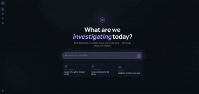

# OpenObs

AI-native observability platform. Investigate incidents, generate dashboards, and manage alert rules — powered by LLMs.



## What It Does

- **Dashboard generation** — Describe what you want to monitor and OpenObs builds a Grafana-style dashboard with real PromQL queries, auto-discovered from your Prometheus instance.
- **Incident investigation** — Ask a question about your system and OpenObs plans an investigation, queries your metrics, and writes a structured report with evidence panels.
- **Alert rule management** — Create and modify alert rules through natural language. "Alert me when p95 latency exceeds 500ms."
- **Conversational editing** — Chat with your dashboard to add panels, rearrange layouts, modify queries, or dig deeper into anomalies.

## Install Paths

OpenObs now ships in two modes:

- **Source mode** for local development: `npm install && npm run start`
- **Cluster mode** for deployment: `helm upgrade --install openobs ./helm/openobs ...`

This mirrors the way projects like Grafana separate **developer setup** from **product installation**.

## Quick Start (Source)

```bash
git clone <repo-url> && cd openobs
npm install
cp .env.example .env        # set JWT_SECRET (min 32 chars)
npm run build
npm run start               # api on :3000, web on :5173
```

Open `http://localhost:5173` — the setup wizard walks you through connecting an LLM provider and data sources.

### Requirements

- Node.js 20+
- An LLM provider (Anthropic, OpenAI, Gemini, Ollama, or Azure/Bedrock)
- A Prometheus-compatible metrics backend (optional — dashboards work without one, but investigation and metric discovery require it)

## Architecture

OpenObs is a TypeScript monorepo with 9 packages:

```
common          shared types, errors, utilities
llm-gateway     LLM provider abstraction (Anthropic, OpenAI, Gemini, Ollama, ...)
data-layer      SQLite persistence (Drizzle ORM)
adapters        observability backend connectors (Prometheus, logs, traces)
adapter-sdk     SDK for building custom execution adapters
guardrails      safety guards (cost, rate limiting, action policy)
agent-core      AI agent logic (orchestration, investigation, dashboard generation)
api-gateway     Express HTTP server + REST API
web             React SPA (Vite + Tailwind CSS)
```

See [ARCHITECTURE.md](./ARCHITECTURE.md) for the full dependency graph, design patterns, and layer diagram.

## Configuration

All configuration is via environment variables. Copy `.env.example` and fill in your values:

| Variable | Required | Description |
|----------|----------|-------------|
| `JWT_SECRET` | Yes | Secret for signing auth tokens (min 32 chars) |
| `API_KEYS` | No | Comma-separated service API keys for server-to-server access |
| `PORT` | No | API server port |
| `HOST` | No | API bind host |
| `CORS_ORIGINS` | No | Comma-separated allowed origins |
| `LLM_PROVIDER` | No | Default LLM provider (set via setup wizard) |
| `LLM_API_KEY` | No | API key for the LLM provider |
| `LLM_MODEL` | No | Default model for the selected LLM provider |
| `LLM_FALLBACK_PROVIDER` | No | Optional fallback provider |
| `DATABASE_URL` | No | Postgres connection string; omit to use local SQLite mode |
| `DATABASE_POOL_SIZE` | No | Database connection pool size |
| `DATABASE_SSL` | No | Enable SSL for Postgres connections |
| `REDIS_URL` | No | Redis connection string |
| `REDIS_PREFIX` | No | Redis key prefix |
| `API_KEY_HEADER` | No | Header name for API key auth |
| `SESSION_TTL` | No | Session TTL in seconds |
| `PROACTIVE_CHECK_INTERVAL_MS` | No | Background proactive-check interval |
| `PROACTIVE_HISTORY_SIZE` | No | Number of historic events to keep for proactive analysis |
| `LOG_LEVEL` | No | `debug`, `info`, `warn`, or `error` |
| `LOG_FORMAT` | No | `json` or `text` |

The setup wizard (`/setup`) configures LLM, data sources, and notifications interactively.

## Development

```bash
npm run build          # TypeScript build (all packages)
npm test               # vitest (all packages)
npm run start          # start API + web dev servers
```

## Documentation

First-party documentation now lives in this repository under [`docs/`](./docs). The recommended setup is:

- product code + docs source in the main `openobs` repository
- marketing site in the separate website repository
- published docs site from this repo, for example `docs.openobs.dev`

Run the docs locally with:

```bash
npm run docs:dev
```

Build the docs with:

```bash
npm run docs:build
```

## Docker Image

OpenObs can be packaged as a single production image that serves both the API and the built React app:

```bash
docker build -t openobs:latest .
docker run --rm -p 3000:3000 \
  -e JWT_SECRET='replace-with-a-32-char-secret' \
  -e LLM_API_KEY='replace-with-your-provider-key' \
  -v openobs-data:/var/lib/openobs \
  openobs:latest
```

Then open `http://localhost:3000`.

## Kubernetes Install (Helm)

The repository includes a first-party Helm chart at [`helm/openobs`](./helm/openobs).

Minimal install:

```bash
helm upgrade --install openobs ./helm/openobs \
  --namespace observability \
  --create-namespace \
  --set image.repository=ghcr.io/your-org/openobs \
  --set image.tag=latest \
  --set secretEnv.LLM_API_KEY='replace-with-your-provider-key'
```

Ingress example:

```bash
helm upgrade --install openobs ./helm/openobs \
  --namespace observability \
  --create-namespace \
  --set image.repository=ghcr.io/your-org/openobs \
  --set image.tag=latest \
  --set ingress.enabled=true \
  --set ingress.className=nginx \
  --set ingress.hosts[0].host=openobs.example.com \
  --set env.CORS_ORIGINS=https://openobs.example.com \
  --set secretEnv.LLM_API_KEY='replace-with-your-provider-key'
```

Useful chart knobs:

- `secretEnv.JWT_SECRET`: optional explicit JWT secret; if omitted, the chart generates one and keeps it on upgrade
- `secretEnv.DATABASE_URL`: switch from local SQLite mode to Postgres
- `secretEnv.REDIS_URL`: enable Redis-backed queue/event features
- `persistence.enabled`: keep SQLite and local state on a PVC
- `env.*`: configure runtime settings such as `LLM_PROVIDER`, `LOG_LEVEL`, and proactive analysis intervals

Render the chart locally with:

```bash
npm run helm:template
```

## Contributing

See [CONTRIBUTING.md](./CONTRIBUTING.md) for development setup, code style, and where to put new code.

## License

MIT
